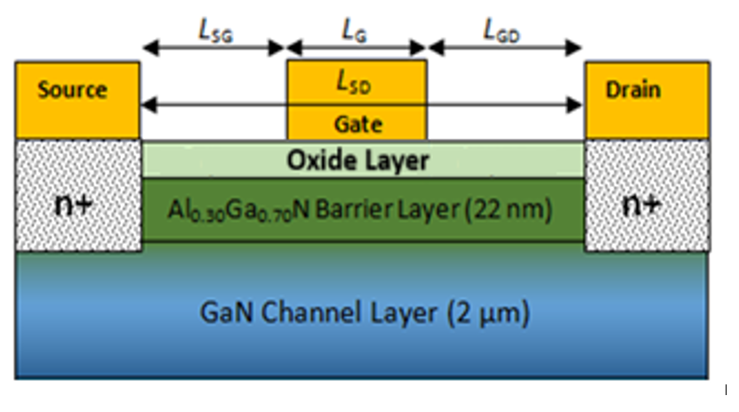
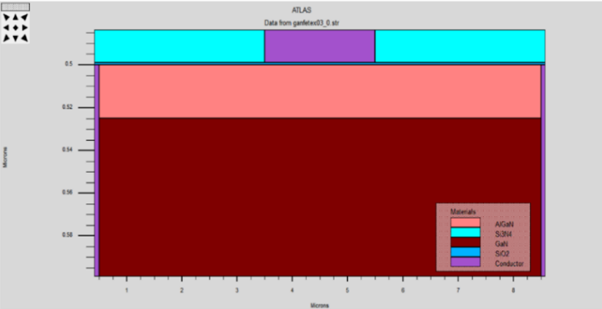
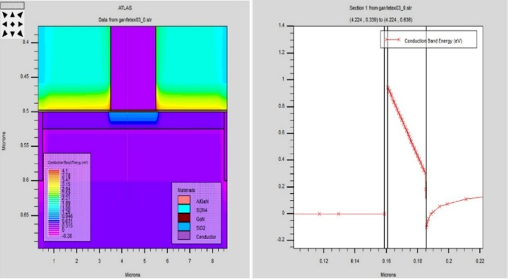
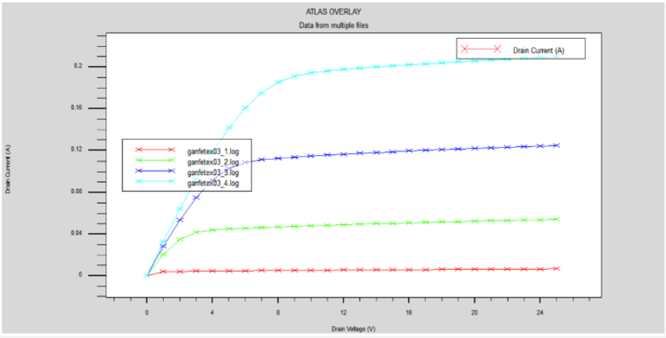
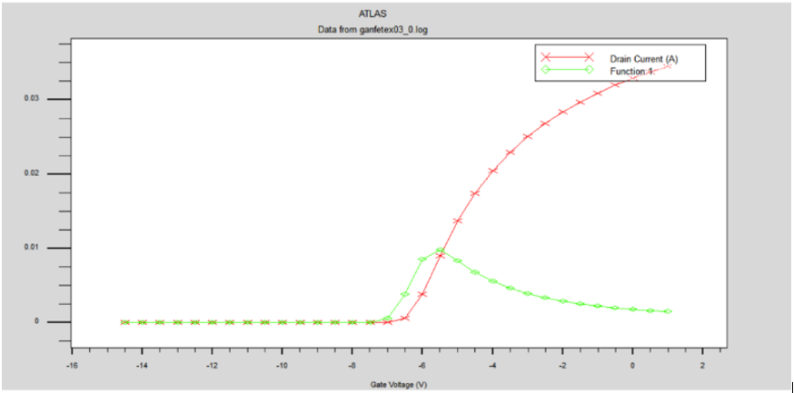

# Analysis of AlGaN/GaN based MOSHEMT by Improving DC and RF Parameters

## Project Overview
This project analyzes the performance of AlGaN/GaN MOSHEMT devices by optimizing DC and RF parameters using Silvaco TCAD simulation tools.

## Objectives
- Improve drain current characteristics
- Enhance RF performance parameters
- Study device behavior under different bias conditions

## Tools Used
- Silvaco TCAD
- TonyPlot
- MATLAB (for graph analysis)

## Parameters Analyzed
- Drain Current (Id)
- Transconductance (gm)
- Cut-off frequency (fT)
- RF gain

## Results
## MOSHEMT Device Structure

## Simulated Device Structure (Silvaco ATLAS)

## Energy Band Distribution

## Output Characteristics (ID – VD)

## Transfer Characteristics (ID – VG)

## Applications
- RF communication systems
- 5G amplifiers
- High-frequency electronics

## Skills Demonstrated
- Semiconductor Device Simulation
- RF Parameter Analysis
- TCAD Modeling
- Data Analysis

